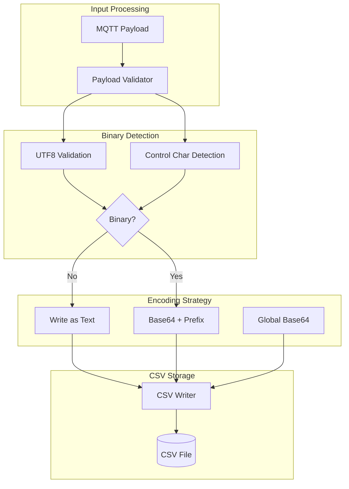
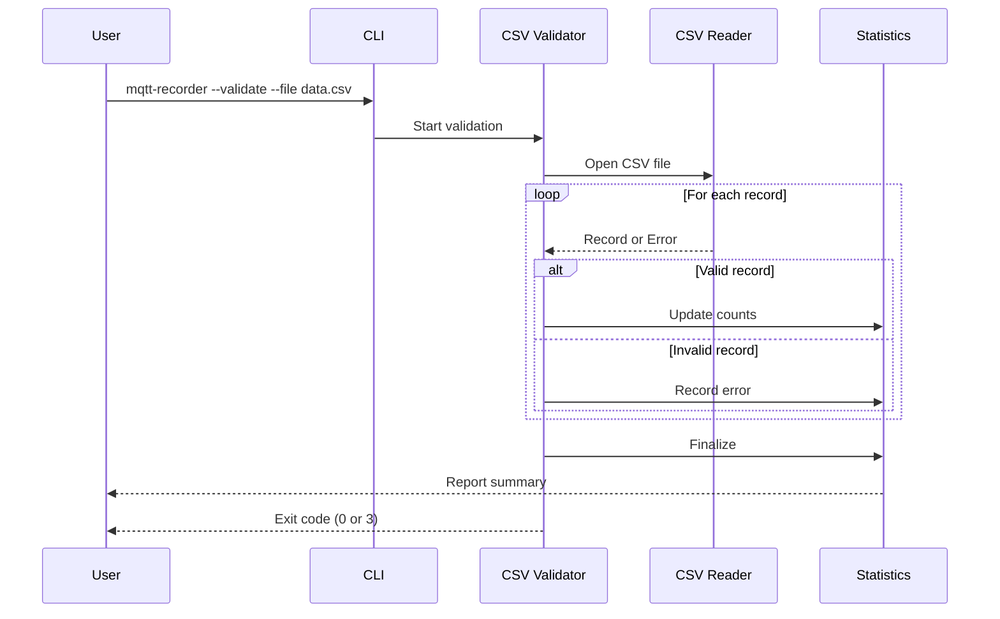

# Design Document: CSV Validation and Binary Payload Handling

## Overview

This design extends the mqtt-recorder's CSV handling to automatically detect and encode binary payloads, add a validation mode for CSV files, and ensure round-trip integrity for all MQTT message types. The solution introduces a "b64:" prefix marker for auto-encoded binary payloads, allowing the system to distinguish between intentionally base64-encoded content and automatically-encoded binary data.

## Architecture



### Validation Flow



## Components and Interfaces

### Payload Validator (`src/csv_handler.rs`)

New component for detecting binary content in payloads.

```rust
/// Determines if a payload contains binary data that requires encoding.
/// 
/// Binary payloads are those containing:
/// - Non-UTF8 byte sequences
/// - Control characters (0x00-0x08, 0x0B-0x0C, 0x0E-0x1F)
/// 
/// Tab (0x09), newline (0x0A), and carriage return (0x0D) are allowed
/// as CSV quoting handles these correctly.
pub fn is_binary_payload(payload: &[u8]) -> bool;

/// The marker prefix used for auto-encoded binary payloads.
pub const AUTO_ENCODE_MARKER: &str = "b64:";
```

### Enhanced CSV Writer (`src/csv_handler.rs`)

Extended to support automatic binary detection and encoding.

```rust
pub struct CsvWriter {
    writer: Writer<File>,
    encode_b64: bool,
    /// Statistics for written records
    stats: WriteStats,
}

#[derive(Debug, Default)]
pub struct WriteStats {
    pub total_records: u64,
    pub text_payloads: u64,
    pub auto_encoded_payloads: u64,
    pub largest_payload: usize,
}

impl CsvWriter {
    /// Write a message record, automatically encoding binary payloads.
    /// 
    /// When encode_b64 is false:
    /// - Text payloads are written as-is
    /// - Binary payloads are base64 encoded with "b64:" prefix
    /// 
    /// When encode_b64 is true:
    /// - All payloads are base64 encoded without prefix (existing behavior)
    pub fn write(&mut self, record: &MessageRecord) -> Result<(), MqttRecorderError>;
    
    /// Write a message record from raw bytes (for binary payloads).
    /// 
    /// This method accepts the payload as bytes rather than a string,
    /// allowing proper handling of non-UTF8 binary data.
    pub fn write_bytes(
        &mut self,
        timestamp: DateTime<Utc>,
        topic: &str,
        payload: &[u8],
        qos: u8,
        retain: bool,
    ) -> Result<(), MqttRecorderError>;
    
    /// Get current write statistics.
    pub fn stats(&self) -> &WriteStats;
}
```

### Enhanced CSV Reader (`src/csv_handler.rs`)

Extended to support automatic binary detection and decoding.

```rust
impl CsvReader {
    /// Read the next message record, automatically decoding binary payloads.
    /// 
    /// When decode_b64 is false:
    /// - Payloads starting with "b64:" are decoded from base64
    /// - Other payloads are returned as-is
    /// 
    /// When decode_b64 is true:
    /// - All payloads are decoded from base64 (existing behavior)
    pub fn read_next(&mut self) -> Option<Result<MessageRecord, MqttRecorderError>>;
    
    /// Read the next record and return payload as bytes.
    /// 
    /// This is useful when the caller needs the raw binary payload
    /// rather than a UTF8 string representation.
    pub fn read_next_bytes(&mut self) -> Option<Result<MessageRecordBytes, MqttRecorderError>>;
}

/// Message record with payload as raw bytes instead of String.
#[derive(Debug, Clone)]
pub struct MessageRecordBytes {
    pub timestamp: DateTime<Utc>,
    pub topic: String,
    pub payload: Vec<u8>,
    pub qos: u8,
    pub retain: bool,
}
```

### CSV Validator (`src/validator.rs`)

New module for CSV file validation.

```rust
use std::path::Path;

/// Result of validating a single CSV record.
#[derive(Debug)]
pub enum ValidationResult {
    Valid,
    InvalidFieldCount { expected: usize, actual: usize },
    InvalidTimestamp { value: String, error: String },
    InvalidQos { value: String },
    InvalidRetain { value: String },
    InvalidBase64 { error: String },
    ParseError { error: String },
}

/// Statistics collected during validation.
#[derive(Debug, Default)]
pub struct ValidationStats {
    pub total_records: u64,
    pub valid_records: u64,
    pub invalid_records: u64,
    pub text_payloads: u64,
    pub binary_payloads: u64,
    pub base64_payloads: u64,
    pub largest_payload: usize,
    pub errors: Vec<ValidationError>,
}

/// A validation error with line number and details.
#[derive(Debug)]
pub struct ValidationError {
    pub line_number: u64,
    pub result: ValidationResult,
}

/// CSV file validator.
pub struct CsvValidator {
    decode_b64: bool,
    field_size_limit: Option<usize>,
}

impl CsvValidator {
    pub fn new(decode_b64: bool, field_size_limit: Option<usize>) -> Self;
    
    /// Validate a CSV file and return statistics.
    /// 
    /// This method reads all records in the file, validating each one
    /// and collecting statistics. It continues even after finding errors
    /// to provide a complete report.
    pub fn validate(&self, path: &Path) -> Result<ValidationStats, MqttRecorderError>;
    
    /// Validate a single record.
    fn validate_record(&self, record: &csv::StringRecord, line_number: u64) -> ValidationResult;
}
```

### CSV Fixer (`src/fixer.rs`)

New module for repairing corrupted CSV files.

```rust
use std::path::Path;

/// Statistics collected during repair.
#[derive(Debug, Default)]
pub struct RepairStats {
    pub total_records: u64,
    pub valid_records: u64,
    pub repaired_records: u64,
    pub skipped_records: u64,
    pub skipped_lines: Vec<u64>,
}

/// CSV file repair utility.
pub struct CsvFixer {
    encode_b64: bool,
}

impl CsvFixer {
    pub fn new(encode_b64: bool) -> Self;
    
    /// Repair a corrupted CSV file.
    /// 
    /// Reads the input file, detects corrupted records caused by
    /// unencoded binary payloads, and writes a repaired version
    /// to the output path.
    pub fn repair(
        &self,
        input: &Path,
        output: &Path,
    ) -> Result<RepairStats, MqttRecorderError>;
    
    /// Attempt to repair a single corrupted record.
    /// 
    /// Returns Some(repaired_record) if repair was successful,
    /// None if the record is unrecoverable.
    fn try_repair_record(&self, raw_line: &str, line_number: u64) -> Option<MessageRecord>;
}
```

### CLI Extensions (`src/cli.rs`)

```rust
#[derive(Parser, Debug)]
pub struct Args {
    // ... existing fields ...
    
    /// Validate CSV file without replaying
    #[arg(long, default_value = "false")]
    pub validate: bool,
    
    /// Repair corrupted CSV file
    #[arg(long, default_value = "false")]
    pub fix: bool,
    
    /// Output file path for --fix mode
    #[arg(long)]
    pub output: Option<PathBuf>,
}

impl Args {
    pub fn validate(&self) -> Result<(), String> {
        // ... existing validation ...
        
        // Validate mode requires a file
        if self.validate && self.file.is_none() {
            return Err("--validate requires --file".to_string());
        }
        
        // Validate mode is incompatible with other modes
        if self.validate && self.mode.is_some() {
            return Err("--validate cannot be used with --mode".to_string());
        }
        
        // Fix mode requires file and output
        if self.fix && self.file.is_none() {
            return Err("--fix requires --file".to_string());
        }
        
        if self.fix && self.output.is_none() {
            return Err("--fix requires --output".to_string());
        }
        
        // Fix mode is incompatible with other modes
        if self.fix && self.mode.is_some() {
            return Err("--fix cannot be used with --mode".to_string());
        }
        
        if self.fix && self.validate {
            return Err("--fix cannot be used with --validate".to_string());
        }
        
        Ok(())
    }
}
```

## Data Models

### Payload Classification

| Classification | Criteria | Encoding |
|---------------|----------|----------|
| Text | Valid UTF8, no control chars (except tab/newline/CR) | Raw string |
| Binary | Invalid UTF8 OR contains control chars | Base64 with "b64:" prefix |
| Global Base64 | encode_b64 flag is true | Base64 without prefix |

### Control Character Ranges

| Range | Description | Treatment |
|-------|-------------|-----------|
| 0x00-0x08 | NUL, SOH, STX, ETX, EOT, ENQ, ACK, BEL, BS | Binary |
| 0x09 | TAB | Allowed (CSV handles) |
| 0x0A | LF (newline) | Allowed (CSV handles) |
| 0x0B-0x0C | VT, FF | Binary |
| 0x0D | CR (carriage return) | Allowed (CSV handles) |
| 0x0E-0x1F | SO through US | Binary |

### CSV Format with Auto-Encoding

```csv
timestamp,topic,payload,qos,retain
2024-01-15T10:30:00.123Z,sensors/temp,{"value": 23.5},0,false
2024-01-15T10:30:01.456Z,binary/data,b64:CAoSGAECAwQ=,0,true
2024-01-15T10:30:02.789Z,text/msg,Hello World,1,false
```

### Validation Report Format

```
CSV Validation Report
=====================
File: recording.csv
Status: PASSED (or FAILED)

Statistics:
  Total records:     1,234,567
  Valid records:     1,234,560
  Invalid records:   7
  Text payloads:     1,000,000
  Binary payloads:   234,560
  Largest payload:   125,839 bytes

Errors (if any):
  Line 2586: Invalid base64 in auto-encoded payload: invalid character at position 45
  Line 3883: Invalid QoS value: "3" (expected 0, 1, or 2)
  ...
```


## Correctness Properties

*A property is a characteristic or behavior that should hold true across all valid executions of a system—essentially, a formal statement about what the system should do. Properties serve as the bridge between human-readable specifications and machine-verifiable correctness guarantees.*

### Property 1: Binary Payload Classification

*For any* byte sequence, the Payload_Validator SHALL classify it as binary if and only if it contains non-UTF8 bytes OR control characters (0x00-0x08, 0x0B-0x0C, 0x0E-0x1F). Valid UTF8 strings containing only printable characters, spaces, tabs, newlines, and carriage returns SHALL be classified as text.

**Validates: Requirements 1.1, 1.2, 1.3, 1.5**

### Property 2: Encoding Strategy Correctness

*For any* payload and encode_b64 setting:
- When encode_b64 is false and payload is binary: output SHALL start with "b64:" followed by valid base64
- When encode_b64 is false and payload is text: output SHALL equal the original payload with no prefix
- When encode_b64 is true: output SHALL be valid base64 of the payload with no prefix

**Validates: Requirements 2.1, 2.2, 2.3**

### Property 3: Decoding Strategy Correctness

*For any* stored payload string and decode_b64 setting:
- When decode_b64 is false and payload starts with "b64:": result SHALL be base64 decode of content after prefix
- When decode_b64 is false and payload does not start with "b64:": result SHALL equal the original payload
- When decode_b64 is true: result SHALL be base64 decode of entire payload

**Validates: Requirements 3.1, 3.2, 3.3**

### Property 4: Validation Error Detection

*For any* CSV record with invalid content (wrong field count, invalid timestamp, invalid QoS, invalid retain, invalid base64), the CSV_Validator SHALL detect and report the error with the correct line number. The validator SHALL continue processing remaining records after finding errors.

**Validates: Requirements 4.3, 4.4, 4.5, 4.6, 4.7, 4.8, 4.11**

### Property 5: Round-Trip Integrity

*For any* valid MessageRecord with arbitrary binary or text payload, writing to CSV (with auto-encoding when needed) and reading back SHALL produce a record with:
- Identical payload bytes
- Identical topic string
- Identical QoS value
- Identical retain flag
- Timestamp preserved to millisecond precision

**Validates: Requirements 5.1, 5.2, 5.3**

### Property 6: Marker Collision Handling

*For any* text payload that literally starts with the string "b64:", the round-trip through CSV write and read SHALL preserve the payload exactly. The system SHALL NOT misinterpret literal "b64:" prefixes in text payloads as auto-encode markers.

**Validates: Requirements 5.4**

### Property 7: Repair Mode Correctness

*For any* corrupted CSV file containing records with unencoded binary payloads, the CsvFixer SHALL produce an output file where:
- All valid records from the input are preserved unchanged
- Corrupted records that can be repaired are written with proper encoding
- Unrecoverable records are skipped and their line numbers reported
- The output file passes validation

**Validates: Requirements 8.2, 8.3, 8.4, 8.5, 8.6, 8.7**

## Error Handling

### Error Categories

| Category | Error Type | Handling Strategy |
|----------|-----------|-------------------|
| Validation | Invalid field count | Report line number and actual count, continue validation |
| Validation | Invalid timestamp | Report line number and invalid value, continue validation |
| Validation | Invalid QoS | Report line number and invalid value, continue validation |
| Validation | Invalid retain | Report line number and invalid value, continue validation |
| Validation | Invalid base64 | Report line number and decode error, continue validation |
| Decoding | Invalid auto-encoded payload | Return error with line context |
| Configuration | --validate without --file | Display error and usage help, exit with code 1 |
| Configuration | --validate with --mode | Display error about incompatibility, exit with code 1 |

### Exit Codes

| Code | Meaning |
|------|---------|
| 0 | Success (including successful validation) |
| 1 | Configuration/argument error |
| 3 | Validation failed (invalid records found) |

## Testing Strategy

### Dual Testing Approach

This feature uses both unit tests and property-based tests:

- **Unit tests**: Verify specific examples, edge cases (empty payloads, marker collisions), and error conditions
- **Property tests**: Verify universal properties across randomly generated inputs

### Property-Based Testing Configuration

- **Library**: `proptest` crate for Rust
- **Minimum iterations**: 100 per property test
- **Tag format**: `// Feature: csv-validation, Property N: <property_text>`

### Test Organization

```
tests/
├── property/
│   └── csv_validation_props.rs    # Properties 1-7
src/
├── csv_handler.rs                 # Unit tests for binary detection, encoding/decoding
├── validator.rs                   # Unit tests for validation logic
└── fixer.rs                       # Unit tests for repair logic
```

### Property Test Implementation Pattern

```rust
use proptest::prelude::*;

proptest! {
    #![proptest_config(ProptestConfig::with_cases(100))]
    
    // Feature: csv-validation, Property 5: Round-Trip Integrity
    #[test]
    fn roundtrip_preserves_binary_payload(
        payload_bytes in prop::collection::vec(any::<u8>(), 0..1000),
        topic in "[a-zA-Z0-9/]+",
        qos in 0u8..=2u8,
        retain in any::<bool>(),
    ) {
        let temp_dir = tempdir()?;
        let file_path = temp_dir.path().join("test.csv");
        
        // Write with auto-encoding (encode_b64 = false)
        {
            let mut writer = CsvWriter::new(&file_path, false)?;
            writer.write_bytes(Utc::now(), &topic, &payload_bytes, qos, retain)?;
            writer.flush()?;
        }
        
        // Read back
        let mut reader = CsvReader::new(&file_path, false, None)?;
        let record = reader.read_next_bytes().unwrap()?;
        
        prop_assert_eq!(record.payload, payload_bytes);
        prop_assert_eq!(record.topic, topic);
        prop_assert_eq!(record.qos, qos);
        prop_assert_eq!(record.retain, retain);
    }
}
```

### Key Test Scenarios

1. **Binary Detection**
   - Pure ASCII text → classified as text
   - UTF8 with emoji → classified as text
   - Bytes with 0x00 (NUL) → classified as binary
   - Bytes with 0x08 (backspace) → classified as binary
   - Text with tabs/newlines → classified as text
   - Invalid UTF8 sequences → classified as binary

2. **Round-Trip**
   - Empty payload
   - Text payload
   - Binary payload (protobuf-like)
   - Payload starting with literal "b64:"
   - Very large payloads (>100KB)

3. **Validation**
   - Valid file with mixed text/binary
   - File with wrong field count
   - File with invalid timestamps
   - File with invalid QoS values
   - File with corrupted base64

4. **Repair**
   - File with unencoded binary payloads
   - File with mixed valid and corrupted records
   - File with unrecoverable records
   - Verify repaired file passes validation

