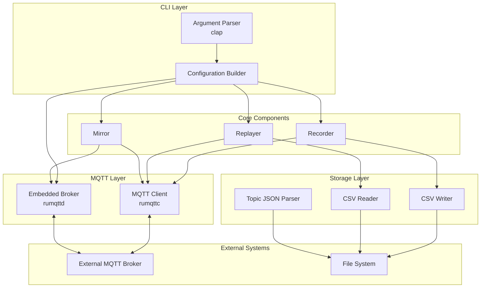
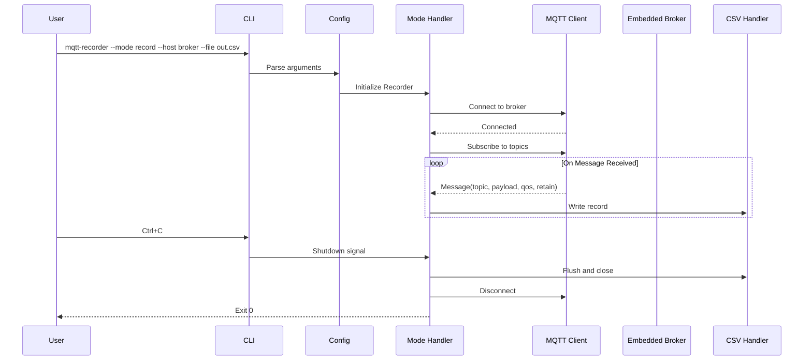
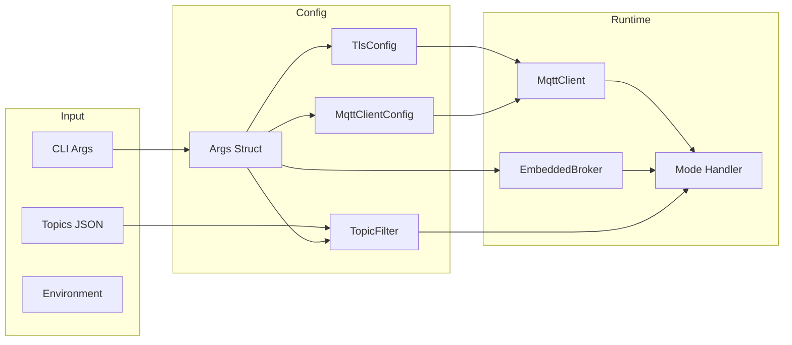

# Design Document: MQTT Recorder

## Overview

The MQTT Recorder is a command-line tool written in Rust that provides four operational modes for working with MQTT message traffic:

1. **Record Mode**: Subscribe to topics on an MQTT broker and persist messages to a CSV file
2. **Replay Mode**: Read messages from a CSV file and publish them to a broker with timing preservation
3. **Mirror Mode**: Subscribe to an external broker and republish messages to an embedded broker in real-time
4. **Serve Mode**: Run a standalone embedded MQTT broker

The tool is built using async Rust with Tokio, leveraging `rumqttc` for MQTT client operations and `rumqttd` for the embedded broker. It follows Rust idioms for error handling, uses `clap` for CLI parsing, and provides comprehensive TLS/authentication support.

## Architecture



### Component Interaction Flow



## Components and Interfaces

### CLI Module (`src/cli.rs`)

Handles command-line argument parsing using `clap` derive macros.

```rust
use clap::{Parser, ValueEnum};
use std::path::PathBuf;

#[derive(Debug, Clone, ValueEnum)]
pub enum Mode {
    Record,
    Replay,
    Mirror,
}

#[derive(Parser, Debug)]
#[command(name = "mqtt-recorder")]
#[command(about = "Record and replay MQTT messages")]
pub struct Args {
    /// MQTT broker address (required unless --serve in replay mode)
    #[arg(long)]
    pub host: Option<String>,

    /// MQTT broker port
    #[arg(long, default_value = "1883")]
    pub port: u16,

    /// MQTT client ID
    #[arg(long)]
    pub client_id: Option<String>,

    /// Operation mode: record, replay, or mirror (optional if --serve alone)
    #[arg(long, value_enum)]
    pub mode: Option<Mode>,

    /// CSV file path for recording/replaying (required for record/replay, optional for mirror)
    #[arg(long)]
    pub file: Option<PathBuf>,

    /// Loop replay continuously
    #[arg(long, default_value = "false")]
    pub loop_replay: bool,

    /// QoS level for subscriptions (0, 1, or 2)
    #[arg(long, default_value = "0")]
    pub qos: u8,

    /// JSON file containing topics to subscribe
    #[arg(long)]
    pub topics: Option<PathBuf>,

    /// Single topic to subscribe
    #[arg(short = 't', long)]
    pub topic: Option<String>,

    /// Enable TLS/SSL
    #[arg(long, default_value = "false")]
    pub enable_ssl: bool,

    /// Skip TLS certificate verification
    #[arg(long, default_value = "false")]
    pub tls_insecure: bool,

    /// Path to CA certificate
    #[arg(long)]
    pub ca_cert: Option<PathBuf>,

    /// Path to client certificate
    #[arg(long)]
    pub certfile: Option<PathBuf>,

    /// Path to client private key
    #[arg(long)]
    pub keyfile: Option<PathBuf>,

    /// MQTT username
    #[arg(long)]
    pub username: Option<String>,

    /// MQTT password
    #[arg(long)]
    pub password: Option<String>,

    /// Encode payloads as base64
    #[arg(long, default_value = "false")]
    pub encode_b64: bool,

    /// CSV field size limit
    #[arg(long)]
    pub csv_field_size_limit: Option<usize>,

    /// Maximum MQTT packet size in bytes (default: 1MB)
    #[arg(long, default_value = "1048576")]
    pub max_packet_size: usize,

    /// Start embedded MQTT broker
    #[arg(long, default_value = "false")]
    pub serve: bool,

    /// Embedded broker port
    #[arg(long, default_value = "1883")]
    pub serve_port: u16,
}

impl Args {
    /// Validate argument combinations
    /// - host is required for record/mirror modes
    /// - host is required for replay mode unless --serve is enabled
    /// - mirror mode requires --serve
    /// - mode is required unless --serve is used alone (standalone broker)
    /// - file is required for record/replay modes, optional for mirror
    /// - TLS options only apply to external broker connections
    pub fn validate(&self) -> Result<(), String>;
    
    /// Get QoS as rumqttc QoS enum
    pub fn get_qos(&self) -> rumqttc::QoS;
    
    /// Check if running in standalone broker mode
    pub fn is_standalone_broker(&self) -> bool;
}
```

### MQTT Client Module (`src/mqtt.rs`)

Wraps `rumqttc` client with connection management and TLS configuration.

```rust
use rumqttc::{AsyncClient, EventLoop, MqttOptions, QoS, Event, Packet};
use std::time::Duration;

pub struct MqttClientConfig {
    pub host: String,
    pub port: u16,
    pub client_id: String,
    pub username: Option<String>,
    pub password: Option<String>,
    pub tls: Option<TlsConfig>,
}

pub struct TlsConfig {
    pub ca_cert: Option<PathBuf>,
    pub client_cert: Option<PathBuf>,
    pub client_key: Option<PathBuf>,
    pub insecure: bool,
}

pub struct MqttClient {
    client: AsyncClient,
    eventloop: EventLoop,
}

impl MqttClient {
    /// Create a new MQTT client with the given configuration
    pub async fn new(config: MqttClientConfig) -> Result<Self, MqttError>;
    
    /// Subscribe to a list of topics with the specified QoS
    pub async fn subscribe(&self, topics: &[String], qos: QoS) -> Result<(), MqttError>;
    
    /// Publish a message to a topic
    pub async fn publish(
        &self,
        topic: &str,
        payload: &[u8],
        qos: QoS,
        retain: bool,
    ) -> Result<(), MqttError>;
    
    /// Poll for the next event from the broker
    pub async fn poll(&mut self) -> Result<Event, MqttError>;
    
    /// Disconnect from the broker
    pub async fn disconnect(&self) -> Result<(), MqttError>;
}
```

### Embedded Broker Module (`src/broker.rs`)

Manages the embedded `rumqttd` broker instance.

```rust
use rumqttd::{Broker, Config, Notification};
use tokio::sync::broadcast;

pub enum BrokerMode {
    Standalone,
    Replay,
    Mirror,
}

pub struct EmbeddedBroker {
    broker: Broker,
    mode: BrokerMode,
    port: u16,
}

impl EmbeddedBroker {
    /// Create and start a new embedded broker
    pub async fn new(port: u16, mode: BrokerMode) -> Result<Self, BrokerError>;
    
    /// Get a client connected to the embedded broker for publishing
    pub async fn get_local_client(&self) -> Result<MqttClient, BrokerError>;
    
    /// Shutdown the broker gracefully
    pub async fn shutdown(self) -> Result<(), BrokerError>;
    
    /// Get the broker's current mode
    pub fn mode(&self) -> &BrokerMode;
}
```

### CSV Handler Module (`src/csv_handler.rs`)

Handles reading and writing message records to CSV files.

```rust
use chrono::{DateTime, Utc};
use csv::{Reader, Writer};
use std::path::Path;

#[derive(Debug, Clone, serde::Serialize, serde::Deserialize)]
pub struct MessageRecord {
    pub timestamp: DateTime<Utc>,
    pub topic: String,
    pub payload: String,
    pub qos: u8,
    pub retain: bool,
}

pub struct CsvWriter {
    writer: Writer<std::fs::File>,
    encode_b64: bool,
}

impl CsvWriter {
    /// Create a new CSV writer, writing header row
    pub fn new(path: &Path, encode_b64: bool) -> Result<Self, CsvError>;
    
    /// Write a message record to the CSV file
    pub fn write(&mut self, record: &MessageRecord) -> Result<(), CsvError>;
    
    /// Flush pending writes to disk
    pub fn flush(&mut self) -> Result<(), CsvError>;
}

pub struct CsvReader {
    reader: Reader<std::fs::File>,
    decode_b64: bool,
    field_size_limit: Option<usize>,
}

impl CsvReader {
    /// Create a new CSV reader
    pub fn new(
        path: &Path,
        decode_b64: bool,
        field_size_limit: Option<usize>,
    ) -> Result<Self, CsvError>;
    
    /// Read the next message record
    pub fn next(&mut self) -> Option<Result<MessageRecord, CsvError>>;
    
    /// Reset reader to beginning of file
    pub fn reset(&mut self) -> Result<(), CsvError>;
}

impl Iterator for CsvReader {
    type Item = Result<MessageRecord, CsvError>;
    fn next(&mut self) -> Option<Self::Item>;
}
```

### Topic Filter Module (`src/topics.rs`)

Handles topic subscription configuration from CLI args or JSON files.

```rust
use std::path::Path;

#[derive(Debug, serde::Deserialize)]
struct TopicsFile {
    topics: Vec<String>,
}

pub struct TopicFilter {
    topics: Vec<String>,
}

impl TopicFilter {
    /// Create from a single topic
    pub fn from_single(topic: String) -> Self;
    
    /// Create from a JSON file
    pub fn from_json_file(path: &Path) -> Result<Self, TopicError>;
    
    /// Create wildcard subscription (subscribe to all)
    pub fn wildcard() -> Self;
    
    /// Get the list of topics
    pub fn topics(&self) -> &[String];
    
    /// Check if empty (no topics)
    pub fn is_empty(&self) -> bool;
}
```

### Error Module (`src/error.rs`)

Defines custom error types using `thiserror`.

```rust
use thiserror::Error;

#[derive(Error, Debug)]
pub enum MqttRecorderError {
    #[error("MQTT connection error: {0}")]
    Connection(#[from] rumqttc::ConnectionError),
    
    #[error("MQTT client error: {0}")]
    Client(#[from] rumqttc::ClientError),
    
    #[error("CSV error: {0}")]
    Csv(#[from] csv::Error),
    
    #[error("IO error: {0}")]
    Io(#[from] std::io::Error),
    
    #[error("JSON parsing error: {0}")]
    Json(#[from] serde_json::Error),
    
    #[error("Invalid argument: {0}")]
    InvalidArgument(String),
    
    #[error("TLS configuration error: {0}")]
    Tls(String),
    
    #[error("Broker error: {0}")]
    Broker(String),
}
```

### Mode Handlers

#### Recorder (`src/recorder.rs`)

```rust
pub struct Recorder {
    client: MqttClient,
    writer: CsvWriter,
    topics: TopicFilter,
    qos: QoS,
}

impl Recorder {
    pub async fn new(
        client: MqttClient,
        writer: CsvWriter,
        topics: TopicFilter,
        qos: QoS,
    ) -> Self;
    
    /// Run the recording loop until shutdown signal
    pub async fn run(&mut self, shutdown: tokio::sync::broadcast::Receiver<()>) -> Result<u64, MqttRecorderError>;
}
```

#### Replayer (`src/replayer.rs`)

```rust
pub struct Replayer {
    client: MqttClient,
    reader: CsvReader,
    loop_replay: bool,
}

impl Replayer {
    pub async fn new(
        client: MqttClient,
        reader: CsvReader,
        loop_replay: bool,
    ) -> Self;
    
    /// Run the replay loop until complete or shutdown
    pub async fn run(&mut self, shutdown: tokio::sync::broadcast::Receiver<()>) -> Result<u64, MqttRecorderError>;
}
```

#### Mirror (`src/mirror.rs`)

```rust
pub struct Mirror {
    source_client: MqttClient,
    broker: EmbeddedBroker,
    local_client: MqttClient,
    writer: Option<CsvWriter>,
    topics: TopicFilter,
    qos: QoS,
}

impl Mirror {
    pub async fn new(
        source_client: MqttClient,
        broker: EmbeddedBroker,
        writer: Option<CsvWriter>,
        topics: TopicFilter,
        qos: QoS,
    ) -> Result<Self, MqttRecorderError>;
    
    /// Run the mirror loop until shutdown
    pub async fn run(&mut self, shutdown: tokio::sync::broadcast::Receiver<()>) -> Result<u64, MqttRecorderError>;
}
```

## Data Models

### Message Record

The core data structure for recorded messages:

| Field | Type | Description |
|-------|------|-------------|
| timestamp | DateTime<Utc> | ISO 8601 timestamp with millisecond precision |
| topic | String | MQTT topic the message was published to |
| payload | String | Message payload (raw or base64 encoded) |
| qos | u8 | Quality of Service level (0, 1, or 2) |
| retain | bool | Whether the message had the retain flag set |

### CSV File Format

```csv
timestamp,topic,payload,qos,retain
2024-01-15T10:30:00.123Z,sensors/temperature,{"value": 23.5},0,false
2024-01-15T10:30:01.456Z,sensors/humidity,{"value": 65},1,true
```

### Topics JSON Format

```json
{
  "topics": [
    "sensors/+/temperature",
    "actuators/#",
    "home/livingroom/light"
  ]
}
```

### Configuration Flow




## Correctness Properties

*A property is a characteristic or behavior that should hold true across all valid executions of a system—essentially, a formal statement about what the system should do. Properties serve as the bridge between human-readable specifications and machine-verifiable correctness guarantees.*

### Property 1: CLI Argument Parsing Preserves Values

*For any* valid combination of CLI arguments with explicit values, parsing those arguments and extracting the values SHALL produce the same values that were provided.

**Validates: Requirements 1.1-1.18**

### Property 2: Invalid Mode Rejection

*For any* string that is not "record", "replay", or "mirror", providing it as the `--mode` argument SHALL result in a parsing error.

**Validates: Requirements 1.19**

### Property 3: Conditional Host Requirement

*For any* argument set where mode is "record" or "mirror", `--host` SHALL be required. *For any* argument set where mode is "replay" and `--serve` is not enabled, `--host` SHALL be required. *For any* argument set where mode is "replay" and `--serve` is enabled, `--host` SHALL be optional.

**Validates: Requirements 1.1, 1.21, 1.22**

### Property 4: Single Topic Filter Construction

*For any* non-empty topic string, creating a TopicFilter from that single topic SHALL produce a filter containing exactly that topic.

**Validates: Requirements 3.2**

### Property 5: JSON Topics File Parsing

*For any* valid JSON object with a "topics" field containing an array of strings, parsing that JSON SHALL produce a TopicFilter containing exactly those topics in the same order.

**Validates: Requirements 3.3, 7.1, 7.2**

### Property 6: Wildcard Topic Preservation

*For any* topic string containing MQTT wildcards (`+` or `#`), the TopicFilter SHALL preserve those wildcards exactly as provided.

**Validates: Requirements 3.4**

### Property 7: Base64 Encoding Round-Trip

*For any* byte sequence representing a message payload, encoding it as base64 and then decoding SHALL produce the original byte sequence.

**Validates: Requirements 4.3, 5.6**

### Property 8: CSV Special Character Escaping

*For any* message payload containing CSV special characters (commas, double quotes, newlines), writing to CSV and reading back SHALL preserve the original payload exactly.

**Validates: Requirements 4.6, 6.2, 6.3**

### Property 9: CSV Message Record Round-Trip

*For any* valid MessageRecord (with valid timestamp, non-empty topic, arbitrary payload, QoS in 0-2, and boolean retain), writing it to CSV and reading it back SHALL produce an equivalent MessageRecord with all fields preserved.

**Validates: Requirements 4.2, 5.2, 5.3, 5.4, 6.1, 6.5, 6.6, 6.7**

### Property 10: Timestamp Difference Calculation

*For any* two MessageRecords with different timestamps, the calculated delay between them SHALL equal the actual difference between their timestamps.

**Validates: Requirements 5.5**

### Property 11: CSV Field Size Limit Enforcement

*For any* CSV field exceeding the configured size limit, reading SHALL fail with an appropriate error rather than silently truncating or accepting the oversized field.

**Validates: Requirements 6.4**

### Property 12: Max Packet Size Configuration

*For any* valid max_packet_size value, the MQTT client SHALL be configured to accept packets up to that size.

**Validates: Requirements 1.19, 1.28**

## Error Handling

### Error Categories

| Category | Error Type | Handling Strategy |
|----------|-----------|-------------------|
| Configuration | Invalid CLI arguments | Display error message and usage help, exit with code 1 |
| Configuration | Invalid JSON topics file | Display parsing error with file path, exit with code 1 |
| Connection | Broker unreachable | Display connection error with host:port, exit with code 2 |
| Connection | Authentication failure | Display auth error (without credentials), exit with code 2 |
| Connection | TLS handshake failure | Display TLS error with certificate info, exit with code 2 |
| File I/O | Cannot create output file | Display file path and OS error, exit with code 3 |
| File I/O | Cannot read input file | Display file path and OS error, exit with code 3 |
| File I/O | CSV parsing error | Display line number and error details, exit with code 3 |
| Runtime | Message publish failure | Log warning, continue operation (recoverable) |
| Runtime | Broker disconnection | Attempt reconnection, exit if persistent |

### Exit Codes

| Code | Meaning |
|------|---------|
| 0 | Success (including graceful shutdown) |
| 1 | Configuration/argument error |
| 2 | Connection/authentication error |
| 3 | File I/O error |
| 4 | Runtime error (unrecoverable) |

### Error Message Format

```
Error: <category>: <specific message>
  Cause: <underlying error if available>
  Hint: <suggestion for resolution if applicable>
```

Example:
```
Error: Connection failed: broker.example.com:1883
  Cause: Connection refused (os error 111)
  Hint: Verify the broker is running and the host/port are correct
```

## Testing Strategy

### Dual Testing Approach

This project uses both unit tests and property-based tests for comprehensive coverage:

- **Unit tests**: Verify specific examples, edge cases, and error conditions
- **Property tests**: Verify universal properties across randomly generated inputs

### Property-Based Testing Configuration

- **Library**: `proptest` crate for Rust
- **Minimum iterations**: 100 per property test
- **Tag format**: `// Feature: mqtt-recorder, Property N: <property_text>`

### Test Organization

```
tests/
├── unit/
│   ├── cli_tests.rs          # CLI argument parsing unit tests
│   ├── csv_tests.rs          # CSV handler unit tests
│   ├── topics_tests.rs       # Topic filter unit tests
│   └── error_tests.rs        # Error handling unit tests
├── property/
│   ├── cli_props.rs          # Properties 1-3: CLI parsing
│   ├── topics_props.rs       # Properties 4-6: Topic filtering
│   ├── encoding_props.rs     # Property 7: Base64 round-trip
│   └── csv_props.rs          # Properties 8-11: CSV handling
└── integration/
    ├── record_test.rs        # End-to-end recording tests
    ├── replay_test.rs        # End-to-end replay tests
    └── mirror_test.rs        # End-to-end mirror tests
```

### Property Test Implementation Pattern

```rust
use proptest::prelude::*;

proptest! {
    // Feature: mqtt-recorder, Property 9: CSV Message Record Round-Trip
    #[test]
    fn csv_roundtrip_preserves_message_record(
        topic in "[a-zA-Z0-9/]+",
        payload in ".*",
        qos in 0u8..=2u8,
        retain in any::<bool>(),
    ) {
        let record = MessageRecord {
            timestamp: Utc::now(),
            topic,
            payload,
            qos,
            retain,
        };
        
        let mut buffer = Vec::new();
        let mut writer = CsvWriter::new(&mut buffer, false)?;
        writer.write(&record)?;
        
        let mut reader = CsvReader::new(&buffer[..], false, None)?;
        let read_record = reader.next().unwrap()?;
        
        prop_assert_eq!(record.topic, read_record.topic);
        prop_assert_eq!(record.payload, read_record.payload);
        prop_assert_eq!(record.qos, read_record.qos);
        prop_assert_eq!(record.retain, read_record.retain);
    }
}
```

### Unit Test Focus Areas

- **Edge cases**: Empty payloads, maximum field sizes, special characters
- **Error conditions**: Invalid inputs, file permission errors, malformed data
- **Integration points**: Component boundaries, async behavior
- **Specific examples**: Known good/bad inputs from requirements

### Integration Test Requirements

Integration tests require a running MQTT broker. Use `testcontainers` crate to spin up an ephemeral Mosquitto broker:

```rust
use testcontainers::{clients::Cli, images::mosquitto::Mosquitto};

#[tokio::test]
async fn test_record_and_replay() {
    let docker = Cli::default();
    let broker = docker.run(Mosquitto::default());
    let port = broker.get_host_port_ipv4(1883);
    
    // Test recording and replay against ephemeral broker
}
```

### CI Test Execution

```yaml
test:
  runs-on: ubuntu-latest
  steps:
    - uses: actions/checkout@v4
    - name: Run unit tests
      run: cargo test --lib
    - name: Run property tests
      run: cargo test --test '*_props' -- --test-threads=1
    - name: Run integration tests
      run: cargo test --test '*_test' -- --test-threads=1
```
